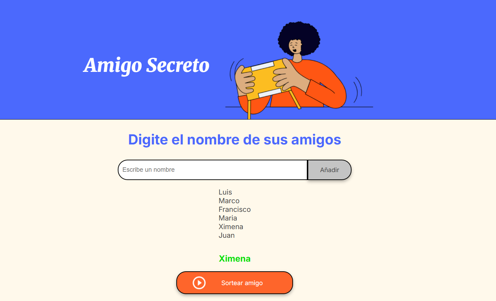

# Amigo Secreto

Esta aplicación permite organizar un sorteo de "amigo secreto"

## Descripción

Esta aplicación permite ingresar nombres de amigos en una lista para luego realizar un sorteo aleatorio y determinar quién es el "amigo secreto".

## Funcionalidades

-  **Agregar nombres:** Los usuarios pueden escribir el nombre de un amigo en un campo de texto y agregarlo a una lista visible haciendo clic en el botón "Añadir".
-  **Validar entrada:** Si el campo de texto está vacío o contiene solo espacios, el programa muestra una alerta solicitando un nombre válido.
-  **Visualizar la lista:** Los nombres ingresados aparecen en una lista debajo del campo de entrada, permitiendo ver todos los participantes.
-  **Sorteo aleatorio:** Al hacer clic en el botón "Sortear Amigo", se selecciona aleatoriamente un nombre de la lista y se muestra el resultado en pantalla.

## Uso

1. Escribe el nombre de un amigo en el campo de texto.
2. Haz clic en "Añadir" para agregar el nombre a la lista.
3. Repite el proceso para todos los participantes.
4. Cuando la lista tenga al menos dos nombres, haz clic en "Sortear Amigo" para elegir al azar quién será el amigo secreto.

¡Disfruta organizando tu sorteo de amigo secreto!
